# Electrum Wallet for Vertcoin

The [Vertcoin Electrum Wallet (Electrum-VTC)](https://github.com/vertcoin/electrum-vtc) is a lightweight wallet which does not require you to download the blockchain data onto your computer (unlike the [Core Wallet](https://github.com/vertcoin/vertcoin)). Instead, it relies on a server-client protocol which means that there is a server somewhere that provides the blockchain information to you on demand. Electrum is first released on 2011 for Bitcoin ([wiki](https://en.bitcoin.it/wiki/Electrum)), but has proven itself sufficiently to be adapted for use by many other cryptocurrencies. 

Table of Content/Overview

Installation

###[PSA: Do not mine to Electrum Wallet! (reddit link)](https://www.reddit.com/r/vertcoin/comments/7ix2jn/do_not_mine_to_a_ledger_or_electrum_wallet_use/)

If you are mining, **DO NOT** mine to Electrum-VTC. Use the [Core Wallet (download link)](https://github.com/vertcoin/vertcoin/releases) instead - the reason being, mining generates a lot of small payments (dust payments) and Electrum-VTC is written with Python, which does not handle all these transactions that well compared to the Core Wallet. Also, since it relies on external servers (which anyone can host), if there is too much volume from mining transactions and the servers get overloaded your transactions will be very very slow to process.

That said, lets get started with Electrum-VTC!

## Getting Started

The guide will include the following series of steps:

1. Installing Electrum-VTC
2. Using Electrum-VTC to send/receive funds
3. Backing up - How to do a backup, what to keep, and how to restore your wallet
4. ​

### Installation for Windows 

To start, navigate to the [Vertcoin-Electrum's Github releases page](https://github.com/vertcoin/electrum-vtc/releases) and download the appropriate version for your computer's Operating System. You may notice that there are two different files that look the same:

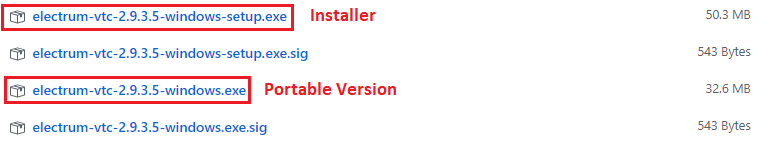

Either version works; the difference being:

* **Installer Version:** Creates files/folders in your PC's windows directories.
* **Portable Version:** Creates file/folders in the directory the .exe file is located - benefits of this is that you can carry it on a USB Drive/Portable HDD.

**Usage & security wise, both versions are equal**. The difference is, if you choose to use the Portable Version one on a USB stick you'd have to be wary of computers which are not secure and/or infected with malware.

Once you double click on your downloaded Electrum-VTC.exe file it should open up to this screen:

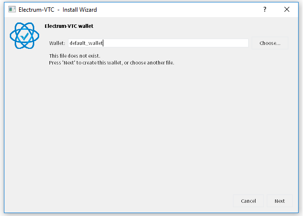

Put whatever name you fancy there, and press `Next` to see the next screen:

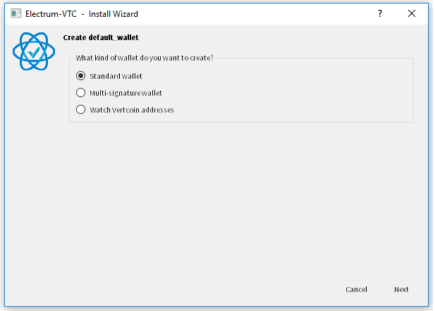

In this guide, we will focus on **Standard wallet**. Select standard wallet and click `Next`. You will see this screen:

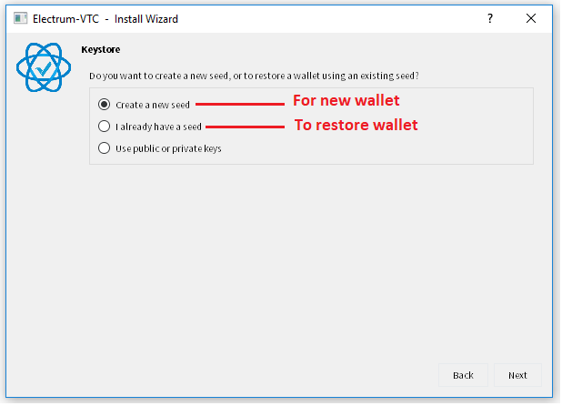

*Note: A multi-signature wallet is a wallet that requires 2 or more signatures before funds can be released. Useful when you have a joint account with someone else, or when you want to make your funds even more difficult for any potential attackers to steal. You can read more about this in the [Electrum.org Documentation](http://docs.electrum.org/en/latest/multisig.html).*

Select `Create a new seed` and click `Next` and you will see 12 words - these are your seed keys a.k.a private keys. **WRITE THESE DOWN AND KEEP THEM SOMEWHERE SAFE!** If someone gets them, they get all your funds.

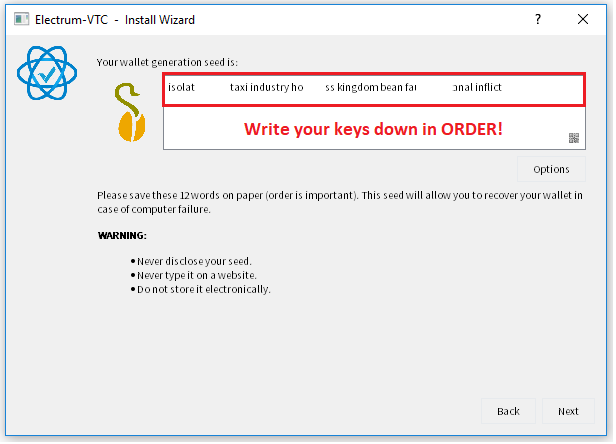

Click `Next`, and you will be prompted to re-enter your seed keys. Look back at your paper and type it in!

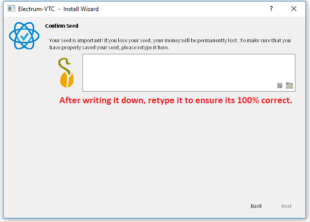

Once that is done, you will be asked to key in your password. This password will be used whenever you wish to send your funds out from the wallet. 

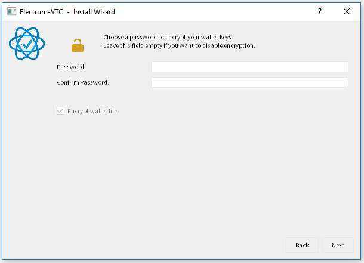

Once you see this screen below - you're ready to go! As long as the bottom right of the UI shows a green color indicating that it is connected to the servers, you can basically start sending/receiving coins. 

*Note: It is probably a good idea to try and send a small amount to test before sending the rest!*

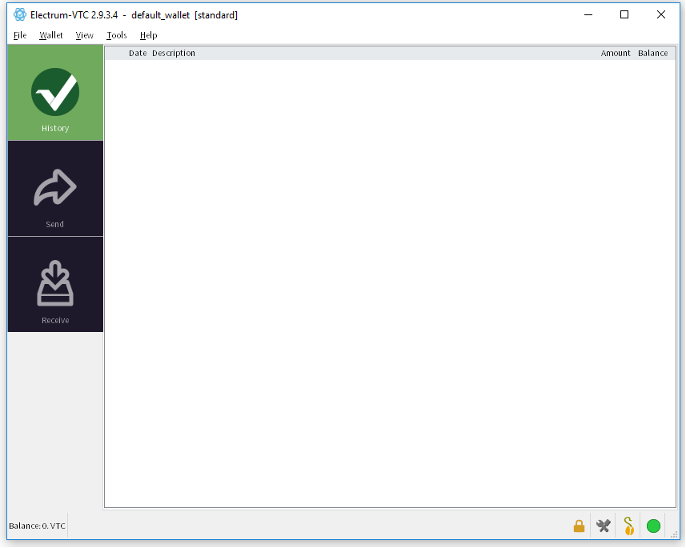

## Using Electrum-VTC

###Receiving Vertcoins

To receive payment in VTC, you'll need to have an address. Navigate to the `Receive` tab for your receive address (*Note: It should start with V. If it is anything else, check and make sure you are using Electrum-VTC!*). Copy the address or scan the QR code. 

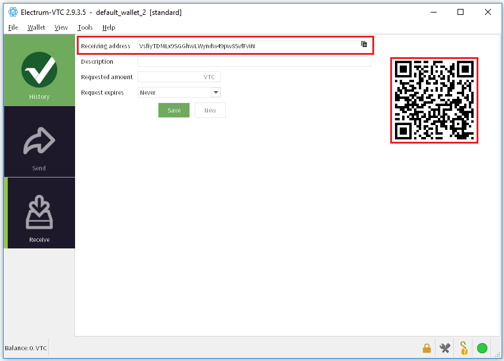

In this example, 0.1 VTC will be sent to this wallet as a demonstration - this will be largely similar to when you receive payments from your buddy for that pizza/beer money and so on. Receiving payment is fairly straightforward - once the other party says that they have sent their Vertcoin, they should provide you with a Transaction ID (see below) which you would be able to look up on block explorer websites such as [Bitinfocharts](https://bitinfocharts.com/vertcoin/explorer/) or [CryptoID](https://bitinfocharts.com/vertcoin/explorer/).

Under normal network load, you should see your transaction almost immediately on the wallet (see below) and you'll should see it as **"Unconfirmed"** - that means that your transaction has been broadcasted to the blockchain, but it has not been added to any blocks yet (also known as "to receive confirmations"). 

If you need more information, you can double click the item for the transaction ID cross-check it with the one your sender has provided you with.

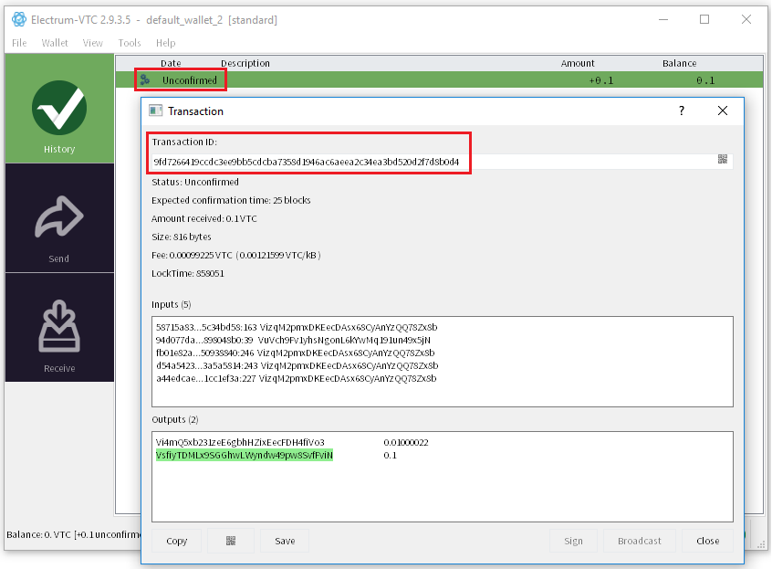

At this point, your payment should be secure - give it more time and you will see that a timestamp appears:

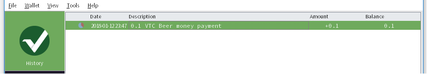

Description can be added as necessary for your to remember the payment details. The little red pie on the left side will slowly turn green as your transaction gets more and more confirmations on the blockchain. You will get a tick when it has  >= 6 confirmations.

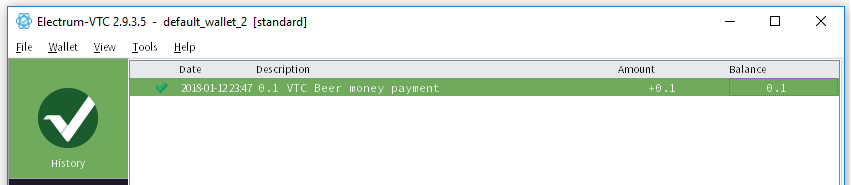

*Note: You can spend the VTC even if there is only one confirmation.*

That's it - that's all there is to receiving payments! Lets move on to sending now.

### Sending Vertcoins

We will try sending the 0.1 VTC above - it will be similar when you try to send funds to someone else as well. The receiving party should give you their Vertcoin receiving address (much like the one we have earlier up there, in the `Receive` tab). Copy that down, and navigate to the `Send` tab on the left side. 

You'll see a couple of fields where you can fill in:

* Pay to - Paste the receiver's address here! Double check the make sure the address is correct.
* Description - Add something for your own reference, so you know what you paid for.
* Amount - How much did the pizza cost you? 
* Fee - Default is 0.002 VTC. More on fees below.

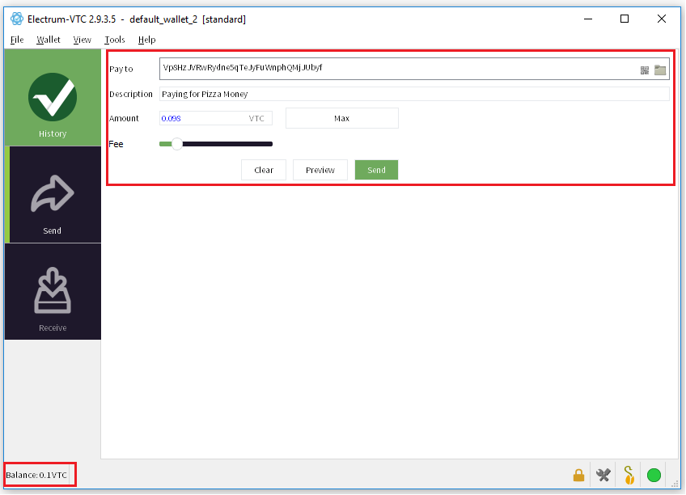

A little snip below will shed more light on how the fee affects your payment. Miners automatically process transactions with higher fees first.

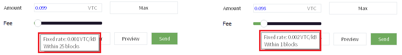

Once again, make sure all details are correct! Click the green `Send` and you'll be prompted to enter your passphrase to authorize the transaction. 

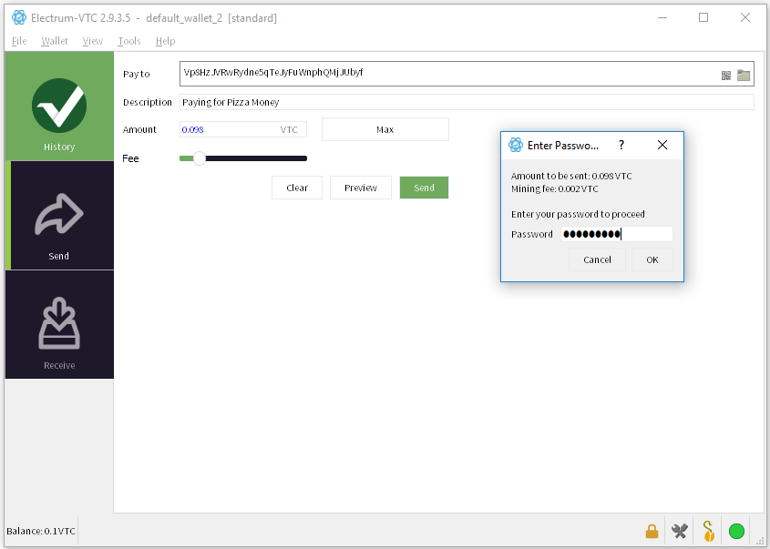

Once the transaction is authorized and broadcasted to the network, you'll see a window with the transaction ID. As with receiving payment, you can use the ID on blockchain explorers such as [Bitinfocharts](https://bitinfocharts.com/vertcoin/explorer/) or [CryptoID](https://bitinfocharts.com/vertcoin/explorer/) for more info.

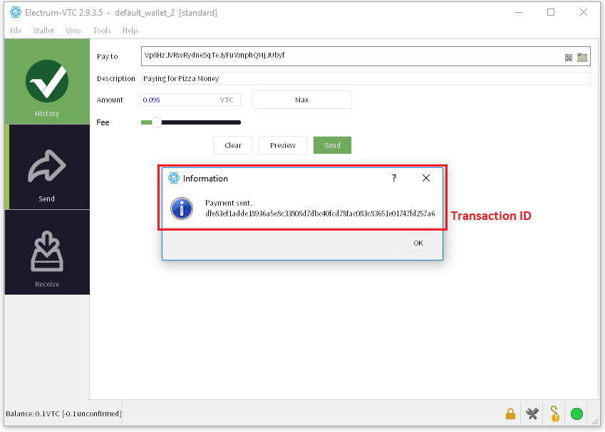

You can then navigate to the `History` tab on the left side if you wish to track it. Initially the payment will be shown as "Unconfirmed". Double click on the transaction to see the status.

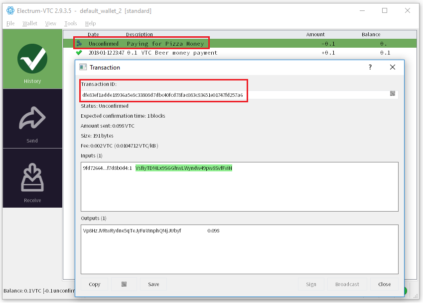

Once the payment is through, you will see that it starts receiving confirmation.

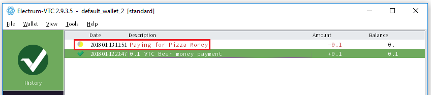

At this point the other party should see the payment reflect in their balance.

And that is all when it comes to Sending Vertcoins!

## Electrum-VTC Security Explained

Seed

Password

Security Summary

### Difference Between the Seed Phrase and Password 

At this point you may wonder - what is the difference between the **Seed keys** you wrote down earlier, and this **password**?

* **Seed keys** - They form your private keys, which helps your to prove ownership of one particular set of coins.
* **Password** - They encrypt your wallet file, meaning if anyone logged onto your computer and/or got hold of your wallet.dat file, they cannot access your funds without your password.

That said, if someone gets your **SEED KEYS**, they basically get your private keys. They can use those to prove to the blockchain that they "own" those coins (*your coins!*). They can then use those seed keys to transfer your balance into their wallet and start spending it for themselves - hence the emphasis throughout this guide to remind you to keep your **Seed Keys** safe!

A table below summarizes the various scenarios and steps to take if they should happen.

* ✓ - indicates that you are confident it is safe and only you have it.
* X - indicates it has been compromised, or that you do not remember it. 

| Password | Seed Keys | Wallet.dat file | Risk Level | To Do                                    |
| :------- | --------- | --------------- | :--------: | :--------------------------------------- |
| X        | ✓         | ✓               |    Low     | As long as you have your seed keys, you will be able to restore your wallet. |
| ✓        | X         | ✓               |   Severe   | Quickly check to ensure your balance is still there. If yes, send it over to a new wallet with a new password. **DITCH THE OLD WALLET AFTERWARDS!** |
| ✓        | ✓         | X               |    Low     | Create a new wallet, encrypt with a different passphrase and sweep the private keys of the old wallet file onto the receiving address of your new wallet. |
| X        | X         | ✓               |   Severe   | Try to remember your password or your seed keys. Otherwise you will LOSE your funds. |
| X        | ✓         | X               |   Severe   | Create a new wallet, secure with a different password and sweep your private keys to retrieve your funds. If you lose both your wallet.dat file and passphrase, your funds are at risk since someone who has both can access your funds. |
| X        | X         | ✓               |   Severe   |                                          |

